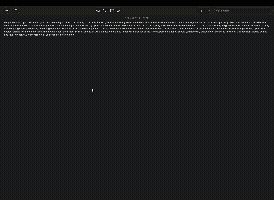
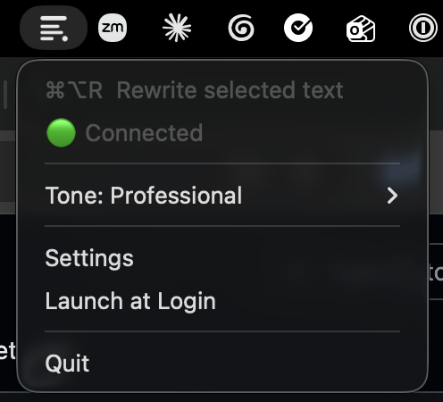
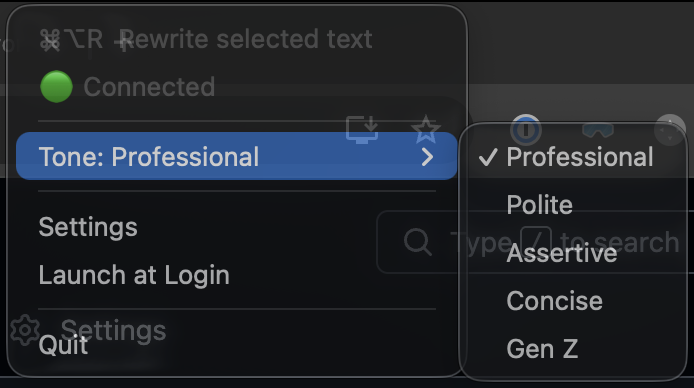
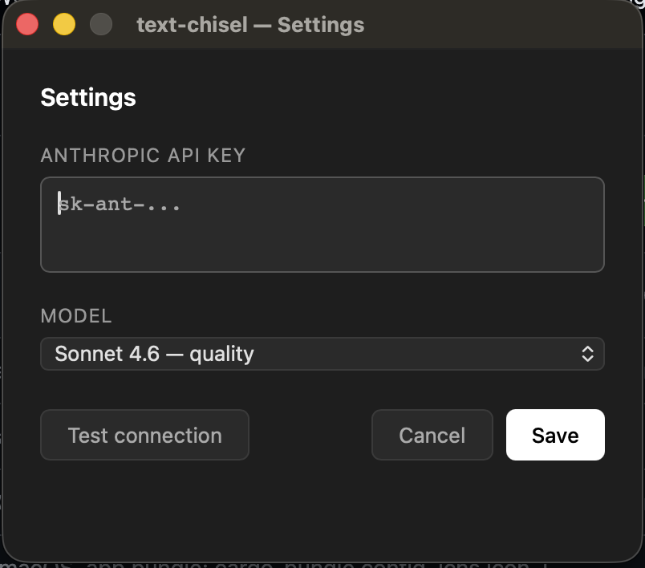

# Text Chisel

[](https://github.com/c0d3-k1ra/text-chisel/actions/workflows/rust.yml)
[](LICENSE)
[](https://www.apple.com/macos/)
[](https://blog.rust-lang.org/2025/02/20/Rust-2024.html)
[](https://github.com/c0d3-k1ra/text-chisel/releases/latest)

**Select text anywhere on your Mac. Press ⌘⌥R. Get it back polished.**

Text Chisel lives in your menu bar and rewrites selected text using Claude AI — no copy-paste, no switching windows, no losing context. Works in any app.



---

## Menu bar



The icon shows your connection status at a glance — 🟢 Connected, 🔴 Not connected, ⏳ Checking. Everything you need is one click away.

---

## Five tones



Pick the right voice for the moment from **Tone** in the menu:

| Tone | What it does |
| --- | --- |
| **Professional** | Neutral and polished — clear without being stiff |
| **Polite** | Soft and respectful — takes the edge off |
| **Assertive** | Direct and firm — makes the point land |
| **Concise** | Strips it down — no filler, no fluff |
| **Gen Z** | Casual and internet-native — lowercase, emojis, the whole bit |

The active tone is shown in the submenu title so you always know your selection without opening it.

---

## Settings



Click **Settings** to configure your API key and model. Hit **Test connection** to verify before saving.

| Setting | Options |
| --- | --- |
| API Key | Your `sk-ant-...` key from [console.anthropic.com](https://console.anthropic.com/) |
| Model | Haiku 4.5 — speed · Sonnet 4.6 — quality |

Settings are saved to `~/.config/text-chisel/config.toml`.

---

## Requirements

- macOS 12 or later
- An [Anthropic API key](https://console.anthropic.com/)
- Accessibility permission (for simulating ⌘C and ⌘V)

---

## Install

### Download

Grab the latest `.zip` from [Releases](https://github.com/c0d3-k1ra/text-chisel/releases), unzip, and drag **Text Chisel.app** to `/Applications`.

**First launch:** macOS will block an unsigned app. Run this once:

```bash
xattr -cr "/Applications/Text Chisel.app"
```

Then launch normally.

### Build from source

```bash
git clone https://github.com/c0d3-k1ra/text-chisel
cd text-chisel
git config core.hooksPath .githooks
cargo install cargo-bundle
cargo bundle --release
```

The app is output to `target/release/bundle/osx/Text Chisel.app`.

---

## First run

On first launch the Settings window opens automatically. Paste your Anthropic API key, pick a model, and click **Save**. macOS will prompt for Accessibility access — approve it in **System Settings → Privacy & Security → Accessibility**.

---

## Error notifications

When something goes wrong, Text Chisel shows a macOS notification with a sound so you always know what happened:

| Situation | Message |
| --- | --- |
| Nothing selected | Select some text first, then press ⌘⌥R |
| No API key | Add your Anthropic API key in Settings to get started |
| Invalid API key | API key not accepted. Open Settings to update it |
| Selection too long | Try again with under 8,000 characters |
| Rate limited | Too many requests. Wait a moment and try again |
| Accessibility denied | Enable Accessibility access in System Settings |

> **Tip:** For notifications to appear on screen, go to **System Settings → Notifications → Script Editor** and set the alert style to **Banners** or **Alerts**.

---

## Limitations

- **macOS only** — relies on AppKit, global hotkeys, and osascript
- **Accessibility required** — cannot simulate ⌘C/⌘V without it
- **8,000 character limit** — longer selections are rejected to keep API costs low
- **No offline mode** — requires a live Anthropic API connection

---

## License

MIT — see [LICENSE](LICENSE).
